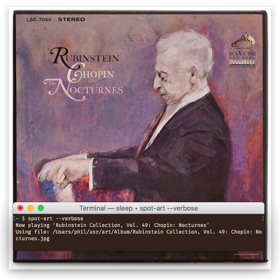

# album-art

Scripts for displaying album art



# `cmus-art`

`spot-art` displays external album art for the song
currently playing in cmus.

Images are displayed using `mpv`, if installed. Otherwise `qlmanage` (a
built-in interface to the "quick look" feature on macOS) is used as a fallback.
If you're not on macOS then you should install `mpv`.

## usage

`cmus-art` looks for an image called `cover.jpg` in the album directory, i.e., 
`$ALBUM/cover.jpg`. You can use the `--verbose` flag to print these locations.

You can also edit the size of the album art (only used in MPV mode) and the
update rate.

```
cmus-art [--verbose]

```

# `spot-art`

`spot-art` displays external album art for the song
currently playing in spotify. It only works on macOS.

Images are displayed using `mpv`, if installed. Otherwise `qlmanage` (a
built-in interface to the "quick look" feature) is used as a fallback.

## usage

`spot-art` pulls images from an album art directory. This defaults to
`~/Desktop` for easy testing, but you probably want to change it. Do this by
editing the $art_dir variable at the start of the script.

You can also edit the size of the album art (only used in MPV mode) and the
update rate.

The script expects ablum art to be located at `$art_dir/album_name.jpg`, where
`album_name` is the exact name that spotify reports. To find these names, run
the script with `--verbose`. This will print what album is being played and
the exact path the script tries for album art.


```
spot-art [--verbose]

```
